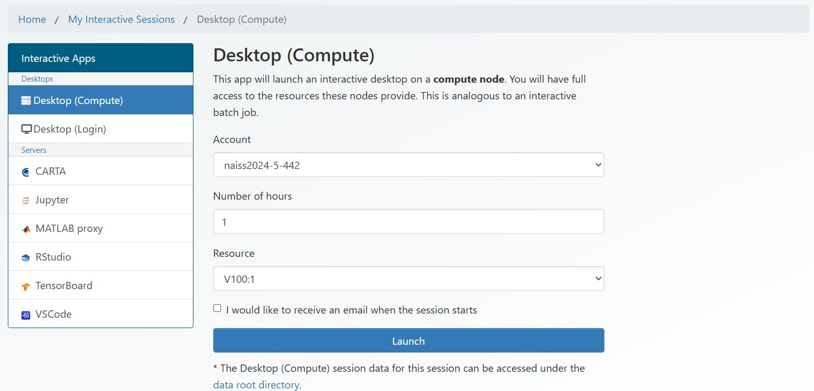
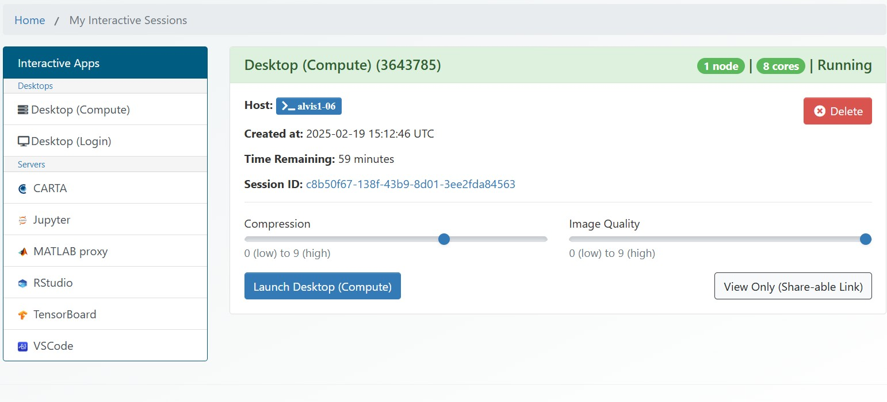
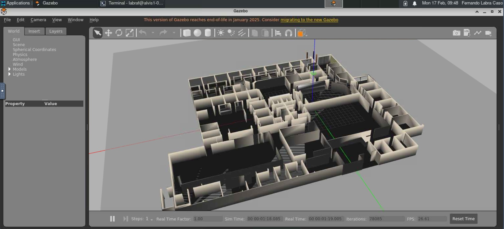
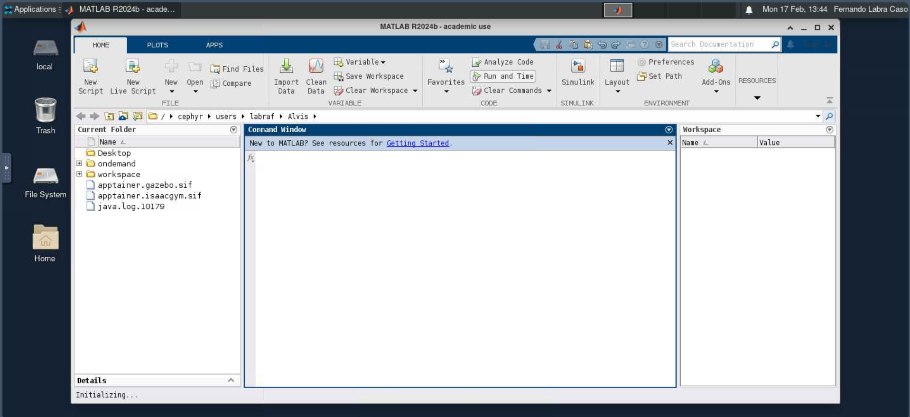

# HPC Cluster Workshop

This repository contains information on HPC clusters, system configuration and job scripts on **(1)** single-machine multi-gpu and **(2)** multi-machine single-gpu deployment, showcasing the necessary code changes in Pytorch framework for distributed NN training. Moreover, the repository contains guidelines for visual applications using the cluster's Desktop OnDemand.

More examples and information on distributed execution can be found on the [Alvis Repository](https://github.com/c3se/alvis-intro)

**NOTE: For any encountered errors or suggestions please open an [issue](https://github.com/fernand0labra/rai-cluster-workshop/issues) on this repository.**

## Table of Contents
1. [Introduction to HPC Clusters](#introduction-to-hpc-clusters)
   * [About HPC Clusters](#about-hpc-clusters)
   * [HPC2N & Alvis](#hpc2n--alvis)
   * [Connecting to HPC Cluster](#connecting-to-hpc-cluster)
   * [Cluster Resource Allocation](#cluster-resource-allocation)
2. [Code Migration & Dependencies](#code-migration--dependencies)
   * [About Proprietary Code](#about-proprietary-code)
   * [Modules System](#modules-system)
   * [Singularity/Apptainer](#singularityapptainer)
3. [Multi-GPU/Multi-Node Training](#multi-gpumulti-node-training)
   * [SLURM Workload Manager](#slurm-workload-manager)
   * [Multi-GPU Code Adaptation](#multi-gpu-code-adaptation)
   * [Multi-Node Code Adaptation](#multi-node-code-adaptation)
4. [Visual Applications with ComputeNode Desktop OnDemand](#visual-applications-with-computenode-desktop-ondemand)
   * [Desktop OnDemand Platform](#desktop-ondemand-platform)
   * [Visual Applications](#visual-applications)
5. [References](#references)

## Introduction to HPC Clusters

### About HPC Clusters

A computer cluster consists of multiple computers (nodes) connected via high-speed networks and working together as a single system. Clusters are cost-effective alternatives to large single computers, offering improved performance and availability.

A node is an individual computer within a cluster, typically containing one or more CPUs (with multiple cores) and possibly GPUs. While memory is shared between cores within the same CPU, it is not shared across different nodes.

Jobs on a cluster are managed through a batch system. Users log in to a "login node" and submit job scripts, which specify requirements like the number of nodes, CPUs, GPUs, memory, runtime, and input data. These scripts enable non-interactive job execution, ideal for resource-intensive tasks that run without user interaction.

### HPC2N & Alvis

There are two clusters available to the RAI group.

1. High Performance Computing Center North (HPC2N) is a national center for Scientific and Parallel Computing. This collaboration and coordination between universities and research institutes form a competence network for high performance computing (HPC), scientific visualization, and virtual reality (VR) in Northern Sweden.

2. The Alvis cluster is a national NAISS resource dedicated for Artificial Intelligence and Machine Learning research. The system is built around Graphical Processing Units (GPUs) accelerator cards, and consists of several types of compute nodes with multiple NVIDIA GPUs.

### Connecting to HPC Cluster

There are 3 primary options for connecting to the cluster environments, namely the [OpenOndemand](https://portal.c3se.chalmers.se/public/root/) portal, [Thinlinc](https://www.cendio.com/thinlinc/download/) connection to the login nodes or SSH access. OpenOndemand and SSH require VPN connection to the university's network.

The OpenOndemand option will be covered in [Visual Applications with ComputeNode Desktop OnDemand](#visual-applications-with-computenode-desktop-ondemand). Connecting with Thinlinc requires the installation of the software plus indicating server (*alvis1.c3se.chalmers.se*), username and password. SSH has a similar approach with the peculiarity of having to request TTY in order for the connection to be correctly setup.

SSH is a straightforward option that will allow you to integrate the cluster workspace into e.g. Visual Studio Code and perform direct edition of the code within the login node. The terminal also allows any other operation such as requesting nodes or creating batch jobs.

```
ssh -t my_username@alvis1.c3se.chalmers.se

************************ Expected entry (.ssh/config) ************************
!! Remember to double check that the SSH entry has the following structure !!

Host HPC-alvis  
  HostName alvis1.c3se.chalmers.se
  User my_username
  RequestTTY yes
```

### Cluster Resource Allocation

Batch or scheduling systems are essential for managing multi-user jobs on clusters or supercomputers. These systems track available resources, enforce usage policies, and schedule jobs efficiently by organizing them into priority queues. Jobs are submitted using job scripts, which specify resource requirements (e.g., nodes, cores, GPUs, memory) and include commands to execute tasks. Outputs and error logs are generated after job completion.

**salloc** is a scheduler command used to allocate a job, which is a set of resources (nodes), possibly with some set of constraints (e.g. number of processors per node). If no command is specified, then by default salloc starts the user’s default shell on the same machine.

```
# Allocate 1 node with 4 workers for 1 hour and 30 minutes
salloc  --account <your project> --nodes=1 --ntasks-per-node=4 --time=1:30:00

# You must use srun to run your job on the allocated resources
srun --ntasks 2 python program.py <ARGS>
```
Each project has a storage folder associated which is orders of magnitude bigger than the equivalent storage of the login or compute node. The path to this storage folder can be found in the project page of [NAISS SUPR](https://supr.naiss.se/project/) for each specific project, under the section Storage/Resource.


## Code Migration & Dependencies

### About Proprietary Code
In order for your personal code to be run in a compute node, it is necessary to allocate the computing resources. Dependencies can be then loaded through the modules system by using the job allocation script format or by bundling them in a container and running the main file.

If modules that are not installed in the system or need to be modified have to be included, then the modules need to be located in the same folder as the main file. However, the dependencies of the modules (e.g. requirements.txt) have to be imported from one of the previously mentioned options.

```
├── module_1
├── module_2
├── ...
└── main.py   -> import module_1 as m1; import module_2 as m2
```

It is possible to connect the login node with your local computer for file transfer through the SFTP/FTP protocol. For Linux users you can check the [scp command](https://linuxize.com/post/how-to-use-scp-command-to-securely-transfer-files/) and Windows users can work with [WinSCP](https://winscp.net/eng/index.php). Usage requires in both cases to indicate the server and the user that will be connected, then locate the desired files and transfer them from or to your local computer.

### Modules System

In high-performance computation, a module system functions as an organized toolbox for software and tools. It enables us to easily access, load, and manage different software packages, compilers, and libraries needed for specific computing tasks. By segregating software environments, we can prevent conflicts and customize setups according to task requirements.

Although one is not allowed to run any computation on the login nodes, it is possible to check the installed modules that exist in the HPC cluster and also list (if any) the loaded modules, which is much more relevant on compute nodes.

```
module spider MODULE  # Check if MODULE exists
module list           # Check loaded modules
```

When the modules that are desired have been identified, they can be loaded within the allocated node (i.e. **salloc**) or indicated in the batch job script by executing the following line.

```
module load PyTorch/2.1.2-foss-2023a-CUDA-12.1.1
```

### Singularity/Apptainer

Apptainer is a container platform. It allows you to create and run containers that package up pieces of software in a way that is portable and reproducible. You can build a container using Apptainer on your laptop, and then run it on many of the largest HPC clusters in the world, local university or company clusters, a single server, in the cloud, or on a workstation down the hall. Your container is a single file, and you don’t have to worry about how to install all the software you need on each different operating system.

The following commands indicate the general operations that can be performed through apptainer: building the image from a definition file, starting a terminal with the container dependencies and executing a specific command.

```
# Build image .sif from definition .def
apptainer build image.sif image.def

# Connect to terminal with dependencies in environment
apptainer shell --nv image.sif

# Execute image .sif
apptainer exec --nv image.sif COMMAND

# --nv                 interface cuda libraries between host and container (default)
# -e                   remove environment variables from host machine
# --env MY_VAR=values  define environment variables
# --pwd DIR            define working environment
# --bind source:end    bind local folder to container folder
```

The apptainer image definition files have a similar structure as those of Docker. For every existing Docker image, it is possible to extend dependencies or configuration during the appatiner building process.

Existing apptainer images usable in the HPC clusters are available at [Alvis repository](https://github.com/c3se/containers), [NVIDIA catalog](https://catalog.ngc.nvidia.com) and [Docker Hub](https://hub.docker.com). The following example defines the container creation for a gazebo server, the **%files** section will copy any indicated files or directories from the localhost onto the container whereas the **%post** section will extend the initial image with the indicated dependencies and configurations.

```
''' Apptainer Image Example file: image.def '''

Bootstrap: docker
From: gazebo:gzserver11

%files
    /mimer/NOBACKUP/groups/ltu-rai-rl2024/my_dir /mnt/my_dir
    /mimer/NOBACKUP/groups/ltu-rai-rl2024/my_file.py /mnt/my_file.py

%post
    # Update locale
    ln -fs /usr/share/zoneinfo/Europe/Oslo /etc/localtime

    # Install dependencies (-y is mandatory to not break the build process)
    apt-get update && \
    apt-get upgrade -y && \
    apt-get install -y PACKAGE
```

## Multi-GPU/Multi-Node Training

### SLURM Workload Manager

SLURM (Simple Linux Utility for Resource Management) is a widely used open-source job scheduling system for Linux and Unix-like environments. It plays a crucial role in managing resources and scheduling on clusters, including many supercomputers.

SLURM provides three main functions:

1. Resource Allocation: Grants users exclusive or shared access to nodes for a set duration.
2. Job Management: Offers a framework for starting, executing, and monitoring parallel job.
3. Queue Management: Manages job queues, resolving contention for resources.

Jobs and the resources associated are requested and controlled through the following commands. The job.sh file contains all the specifications for the allocation and the programs to be executed.

```
sbatch job.sh                  # Submit a job
squeue -u USERNAME -j JOBID    # Job status
scontrol show job JOBID        # Job information
scancel JOBID                  # Cancel a job

!! Remember to cancel the running job before requesting a new one if the running job does not have your desired code or configuration !!
```

SLURM directives in job scripts are prefixed with **#SBATCH**, while general comments are prefixed with **#**. This system enables efficient resource utilization and streamlined job execution on high-performance computing systems.

```
''' Job Script Example file: job.sh '''

#SBATCH --account NAISSXXXX-YY-ZZZZ     # The name of the project you are running in, mandatory.
#SBATCH --job-name my_job_name          # Give a sensible name for the job
#SBATCH --time=00:15:00                 # Request runtime for the job (HHH:MM:SS)

#SBATCH --error=job.%J.err              # Set the names for the error and output files 
#SBATCH --output=job.%J.out             # %J is equivalent to the specified job name

# The following directives set up two nodes with 1 V100 GPU each
# ********************************************************************************************* #
#SBATCH --ntasks 2                      # Number of workers (recommended 1 worker per GPU)
#SBATCH --nodes 2                       # Number of nodes
#SBATCH --gpus-per-node=V100:1          # Number of GPU cards needed per node
# ********************************************************************************************* #

srun python program.py <ARGS>           # Run program on allocated resources
```

GPU types include **T4**, **A40**, **V100**, **A100** and **A100fat**. When no GPU type is specified the scheduler will allocate any free GPU in the cluster. A more detailed display on GPU types for Alvis CS3E is shown below. For more information read the clusters' documentation indicated in the references.

|                     |                   |                                |                         | 
| :-                  | :-                | :-                             | :-                      | 
| GPU Type            | VRAM              | System memory per GPU          | CPU cores per GPU       |
| T4 | 16 GB | 72 or 192 GB | 4 | 
| A40 | 48 GB | 64 GB | 16 | 
| V100 | 32 GB | 192 or 384 GB | 8 | 
| A100 | 40 GB | 64 or 128 GB | 16 | 
| A100fat | 80 GB | 256 GB | 16 |  
|                     |                   |                                |        


The following directive allocates a node exclusively for a job even if there is enough resources for another job.
```
#SBATCH --exclusive
```

The following directive allows the selection of the type of instance of the nodes allocated on the cluster.
```
#SBATCH --constraint=skylake  # HPC2N example
```

### Multi-GPU Code Adaptation

In order to extend any code to use Multi-GPU behavior, it is necessary to include some logic to distribute computation between processes and GPUs. In this example, two GPUs from one node are allocated and one process per GPU is spawned; performing training on partial sections of the data and sending/gathering the computed gradients to update the model.

```
# Obtain process number (given by torchrun, defaults to 0)
rank = int(os.getenv("LOCAL_RANK", "0"))

# Define span of processes as number of GPUs
world_size = torch.cuda.device_count()

...

# Initiate distributed logic by indicating identity (rank) and span (world_size)
# NCCL is the communication process used between processes (recommended)
dist.init_process_group('nccl', rank=rank, world_size=world_size)

...

# Add distributed data behavior
train_data = CustomDataset(data_x[:train_size], data_y[:train_size])
train_sampler = torch.utils.data.distributed.DistributedSampler(train_data)

...

# Instantiate model and move to specified GPU (rank)
model = CustomNet().to(rank)

# Wrap model for distributed data inference
model = DistributedDataParallel(model, device_ids=[rank])

...

# Synchronize all processes by communication of gradients
# Usage after each epoch of training and validation
dist.barrier()

...

# When finishing the process, close distributed communication
dist.destroy_process_group()
```

This code is launched from the **sbatch** utility for job allocation with the following configuration. There will be only 1 task associated to the single node as the distributed wrapper from torch will take care of the process creation. In the job.sbatch file there are two options for the execution of the code, whether via the modules system or the apptainer container system.

```
sbatch job.standalone.sbatch

---

#SBATCH --ntasks 1                      # Number of workers (preferable to be same as number of GPUs i.e. 'nodes' x 'gpus-per-node')
#SBATCH --nodes 1                       # Number of nodes
#SBATCH --gpus-per-node=V100:2          # Number of GPU cards needed. Here asking for 2 V100 cards
```

With the following option, the cluster modules system loads in the environment a specific package, namely a pytorch module with version 2.1.2 compiled with CUDA 12.1.1 . Afterwards, torchrun launches the distributed run by indicating the number of nodes and processes, as well as the main training file. The standalone flag considers server-client behavior to be contained in the same node, meaning that communication will be performed on a local basis.

```
module load PyTorch/2.1.2-foss-2023a-CUDA-12.1.1
torchrun --standalone --nnodes=1 --nproc_per_node=2 src/standalone.py
```

In a very similar way, the previous execution can be performed through a container. As shown below, **apptainer.torch.def** indicates that from DockerHub the builder will select the container image that has specifically the same torch and CUDA versions as the modules counterpart.

```
''' Apptainer definition file: apptainer.torch.def '''

Bootstrap: docker
From: pytorch/pytorch:2.1.2-cuda12.1-cudnn8-runtime
```

The image is built by indicating the definition file and output file names. Afterwards, the execution can be done through the **apptainer exec** command, wrapping the same command that was used before. This procedure associates the execution environment defined in the container for the local file and its dependencies.

```
# Build image from definition file
apptainer build apptainer.torch.sif apptainer.torch.def

---

# Run apptainer image with specified command
apptainer exec --nv apptainer/apptainer.torch.sif \
    torchrun --standalone --nnodes=1 --nproc_per_node=2 src/standalone.py
```

### Multi-Node Code Adaptation

In a similar way as the Multi-GPU case, it is necessary to include some logic to distribute computation between nodes. In this example, two nodes with one GPU each are allocated and one process per GPU is spawned. Some elements such as the communication and gradient sharing need to be performed on the node level (rank), whereas the model training needs to be taken into account on the process scope (local_rank).

```
# Obtain node number (given by torchrun, defaults to SLURM node number)
node = int(os.environ.get('RANK', os.environ.get('SLURM_PROCID')))

# Obtain process number (given by torchrun, defaults to SLURM process number)
local_rank = int(os.environ.get('LOCAL_RANK', os.environ.get('SLURM_LOCALID')))

# Define span of processes from SLURM tasks
world_size = int(os.environ.get('WORLD_SIZE', os.environ.get('SLURM_NTASKS')))

...

# Initiate distributed logic by indicating identity (node) and span (world_size)
# NCCL is the communication process used between processes (recommended)
dist.init_process_group('nccl', rank=node, world_size=world_size)

...

# Add distributed data behavior
train_data = CustomDataset(data_x[:train_size], data_y[:train_size])
train_sampler = torch.utils.data.distributed.DistributedSampler(train_data)

...

# Instantiate model and move to specified GPU (local_rank)
model = CustomNet().to(local_rank)

# Wrap model for distributed data inference
model = DistributedDataParallel(model, device_ids=[local_rank])

...

# Synchronize all processes by communication of gradients
# Usage after each epoch of training and validation
dist.barrier()

...

# When finishing the process, close distributed communication
dist.destroy_process_group()
```

Once more, the resources are requested through **sbatch**. In HPC2N Kebnekaise, node sharing allows to use 1 GPU from as many different machines as possible. However, in Alvis CS3E this behavior is not implemented and the only possibility is to allocate the full node; for this reason the *--gpus-per-node* flag indicates 4 GPUs per node even if the example uses only one GPU per node.

```
sbatch job.multiple.sbatch

---

#SBATCH --ntasks 2                      # Number of workers (preferable to be same as number of GPUs i.e. 'nodes' x 'gpus-per-node')
#SBATCH --nodes 2                       # Number of nodes
#SBATCH --gpus-per-node=V100:4          # Number of GPU cards needed. Here asking for 4 V100 cards
```

Multi-node behavior needs to use the **mpirun** tool from OpenMPI; which offers the logic, control and communication necessary to have an execution distributed onto several nodes. In the following module systems' example, the tool instantiates 2 processes that will run each the deploy.sh bash script.

```
module load PyTorch/2.1.2-foss-2023a-CUDA-12.1.1
mpirun -np 2 bash job.deploy.sh
```

In a similar way the containerized version can be run: After loading the OpenMPI module, the container is used parallely to define for each node process the same dependencies' environment.

```
# Run apptainer image with specified command
module load OpenMPI/4.1.5-GCC-12.3.0
mpirun -np 2 \
   apptainer exec --nv apptainer/apptainer.torch.sif \
       bash job.deploy.sh
```

The **deploy.sh** bash script reads environment variables such as the host or the SLURM node list to create a list of nodes e.g. *'alvis-13, alvis-14'*. Afterwards, each node is contrasted against the master node's name (selected as the first node on the list) and the hostname. In this way, each process running on each node will only execute once and specifically the line that should be associated (master or worker).

In this example, **torch.distributed.run** is used which is an older version of torchrun but provides the same functionality. The *node_rank* indicates the ID of the node that is running the process and the *rdvz* flags (which are defaulted on standalone) indicate the master/worker behavior needed in the distributed execution. This is specially noticeable on *rdvz_endpoint* where on the master is *localhost:12345* whereas on each worker will be *$MASTER* or *alvis-13:12345* according to the example node list.

```
if [[ $MASTER = $HOST ]]; then
   echo "$full_node is the master node (rank $RANK). Performing master-specific tasks..."
   python3 -m torch.distributed.run --nproc_per_node=1 --nnodes=2 --node_rank=0 --rdzv_id=123 --rdzv_backend=c10d --rdzv_endpoint=localhost:12345 src/multiple.py
   break
elif [[ $full_node = $HOST ]]; then
   echo "$full_node is a worker node (rank $RANK). Performing worker-specific tasks..."
   python3 -m torch.distributed.run --nproc_per_node=1 --nnodes=2 --node_rank=$RANK --rdzv_id=123 --rdzv_backend=c10d --rdzv_endpoint=$MASTER:12345 src/multiple.py
   break
fi
```

## Visual Applications with ComputeNode Desktop OnDemand

### Desktop OnDemand Platform

In Desktop [Open OnDemand](https://portal.c3se.chalmers.se/public/root/) there are two desktop apps "Desktop (Compute)" and "Desktop (Login)". Both will give you an interactive desktop session, however the compute node allows some actual computations whereas the shared login node allows small tests or builds. The interactive sessions platform as shown in the left image, provides a selection of time and resources to the instantiated desktop instance. Once the instance is created, selection on compression and image quality is available to facilitate low-bandwith connections. 

It is recommended to select one of the lower cost GPUs such as T4s but usually V100s are the most available. When leaving the OnDemand webpage, remember to logout so that the session is finished and only the exact amount of time used is drawn.

<table>
<tr>
<td></td>
<td></td>
</tr>
</table>

### Visual Applications

There is a myriad of available graphical applications for use within the desktop instance: examples include Matlab, R or Jupyter Notebooks. However, if a different non-installed graphical application is needed, it is possible to use apptainer to run whichever software. In the left image example, gazebo is instantiated from terminal by running a container which is built upon the gazebo11 server docker image.

```
''' Apptainer definition file: apptainer.gazebo.def '''

Bootstrap: docker
From: gazebo:gzserver11

%post
    # Update locale
    ln -fs /usr/share/zoneinfo/Europe/Oslo /etc/localtime

---

apptainer build apptainer.gazebo.sif apptainer.gazebo.def
vglrun +v apptainer exec --nv apptainer.gazebo.sif gazebo worlds/willowgarage.world
```

<table>
<tr>
<td></td>
<td></td>
</tr>
</table>

## References

### About HPC2N

|                           |                                                   | 
| :-                        | :-                                                |
| HP2CN Information         | https://www.hpc2n.umu.se/about                    |
| HP2CN HP2CN Documentation | https://docs.hpc2n.umu.se/tutorials/clusterguide/ |


### About Alvis


|                           |                                                                           | 
| :-                        | :-                                                                        |
| Alvis Information         | https://www.c3se.chalmers.se/about/Alvis/                                 |
| Alvis Documentation       | https://www.c3se.chalmers.se/documentation/for_users/intro-alvis/slides/  |


### SLURM Documentation (HPC2N)


|                           |                                                                           | 
| :-                        | :-                                                                        |
| Basic Commands            | https://docs.hpc2n.umu.se/documentation/batchsystem/basic_commands/       |
| Basic Examples            | https://docs.hpc2n.umu.se/documentation/batchsystem/basic_examples/       |
| Submit File Design        | https://docs.hpc2n.umu.se/documentation/batchsystem/submit_file_design/   |
| Job Submission            | https://docs.hpc2n.umu.se/documentation/batchsystem/job_submission/       |
| Batch Scripts             | https://docs.hpc2n.umu.se/documentation/batchsystem/batch_scripts/        |
